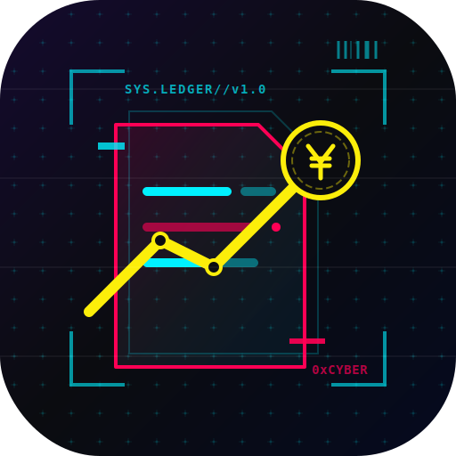

<div align="center">
  
  <h1>Cyber Ledger (赛博账本) v1.0.0</h1>
  <p><strong>一款专为数字游民、极客及 AI 开发者打造的离线资产管理系统。</strong></p>
  
  <p>
    <a href="https://reactjs.org/"></a>
    <a href="https://vitejs.dev/"></a>
    <a href="https://tailwindcss.com/"></a>
    <a href="https://capacitorjs.com/"></a>
    <a href="LICENSE"></a>
  </p>
</div>

---

## 📖 项目全景与初衷

Cyber Ledger 并非传统记账工具。它是对传统流水收支账单痛点及当下极客技术环境深度剖析后建立的**资金全链路沙盒系统**。 

在这里，不仅仅有强大的多账户资金网关与报销池管控，我们更为从事 AI、大语言模型开发的极客群体内置了独一无二的算力计费与 Token 换算器。配合跨端 (Web, Android) 适配与双链路(本地缓存+密码私有云同步)数据灾备安防，你对每一笔数字经济的控制力将突破以往的次元上限。

## 🌟 核心纪元特性 (Features)

🔹 **硬件算力与 API 引擎计价器**
破除高认知门槛，内置各大平台 GPU 及按兆 (M) Token 计费模式计算模型，精准呈现“炼丹”开销。

🔹 **结余无缝结转系统 (Rollover)**
抛弃次月“资产截流”，自动将上月诸如“饮食、娱乐、生活、赛博消费”中未烧完的余粮进行结转累加（配有强烈的流光充能动画），获得优先扣除权，鼓励开源节流。

🔹 **双生池隔离（待报销资金隔离）**
因公出差时，点亮“待报销”开关，这些账单不再侵占你当月的消费定额红线，而是进入只读暂扣缓存池。支持对一堆暂存烂账进行“一键快速归真式核销（报销打款）”。

🔹 **周期性全自动复利续费监视**
无论 ChatGPT Plus、Netflix 抑或某小众服务器节点，预设好扣款日与默认资金池，到期提醒并直接生成流水，摆脱忘扣被封号的隐忧。

🔹 **防御级本地存储及 WebDAV 并发同轨**
主张 Local-First，极致轻快。所有流水数据落账本机持久化，提供 4 位数字锁 (PIN Blockade) 以及免登支持 WebDAV 的跨平台增量补丁多级拉取与推进。

🔹 **真·全局追溯推演与自洽对账**
舍弃易错的 `balance` 死数据字段记录，实体钱包的账表与统计大盘百分百由“创世纪”以来产生的所有交易推断并投影，保证对账精准并永远有迹可循。

## 🚀 起步指南 (Getting Started)

### 前置条件

* Nodes.js (v18+)
* NPM / PNPM
* Android Studio (如需编译 Android 安装包)

### 开发环境极速重构

1. **克隆赛博舱到本地**
   ```bash
   git clone https://github.com/YourUsername/Cyber-Ledger.git
   cd Cyber-Ledger
   ```

2. **装载组件能源核心**
   ```bash
   npm install
   ```

3. **激活本地反应堆 (Dev Server)**
   ```bash
   npm run dev
   ```
   > 容器将在 `http://localhost:5173` 点亮！请由现代浏览器登舱。

### � 分发并构建 Android 安装包 (APK)

我们借由 Capacitor (极光桥技术) 实现一套代码降级适配并打包出近乎原生操作手感的 Web-Native 应用。

1. **执行静态资产压制**
   ```bash
   npm run build
   ```

2. **融合至 Android 舰岛**
   ```bash
   npx cap sync android
   ```

3. **原生下线生产或拉起 Android Studio IDE**
   ```bash
   cd android && ./gradlew assembleDebug
   # 或者直接： npx cap open android 进入可视化编译台
   ```

成品安装包生成位置：`android/app/build/outputs/apk/debug/app-debug.apk`

*注：本仓库内已在根目录分发了一份编译好的预发测试包：`CyberLedger.apk`*

## 🎨 系统模块截面导览
* **`🏠 Home` (主控台与总阀板)**：负责日常高速记账、快捷命令收纳、分类预算结转余量与核心月报开支占比雷达。
* **`🧾 Transactions` (账务全景瀑布)**：按照标准东八区时间精准回档、支持极细颗粒度删表。
* **`📈 Stats` (归档报表与心愿单)**：承载过去每一年、每一月的柱状热力总表。并驻扎“心愿单 (Saving Goals)”的蓄水池系统。
* **`💳 Accounts` (实体资金库隔离)**：实时监控你手下每一个钱包活水，管理独立资产流及编辑统筹功能。
* **`⚙️ Settings` (赛博中枢权限网)**：掌控高灵敏度的词典编辑、备份协议激活与全局暗锁。

## 🤝 参与开源建设 (Contribution)

非常欢迎极客同志提交 Pull Request 增加特性组件。 
如果你发觉本记账体系中任何模块有违常识且亟待重构，请果断提交 `Issue`，本产品永远保持进化态不设上限！

## 📄 授权协议 (License)

本代码遵循 **MIT License** —— 赋予开发者无尽重构自由空间的终极免责守护契约。详见 `LICENSE`。

---
<p align="center">
  <b>Designed with passion and logic by Xiao-yo.</b><br>
  <i>"Control your wealth like writing an invincible code block."</i>
</p>    
